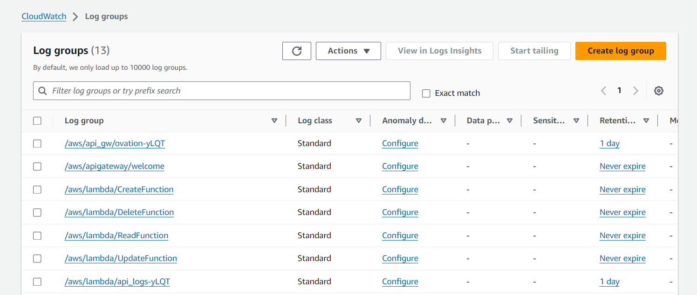
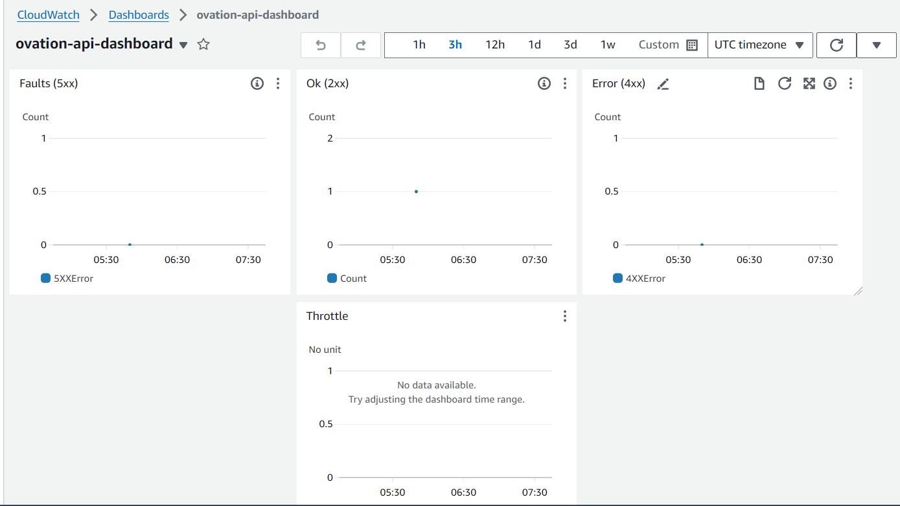
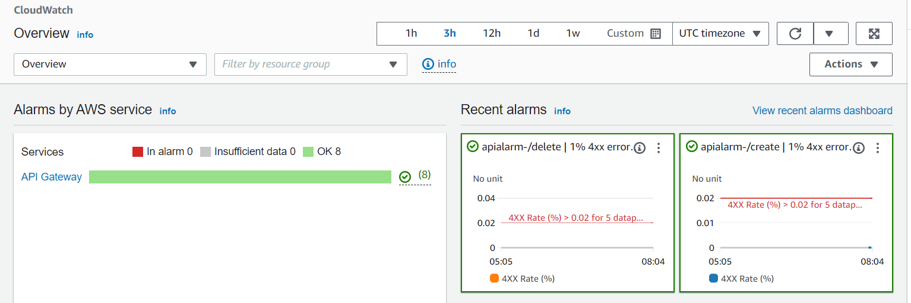
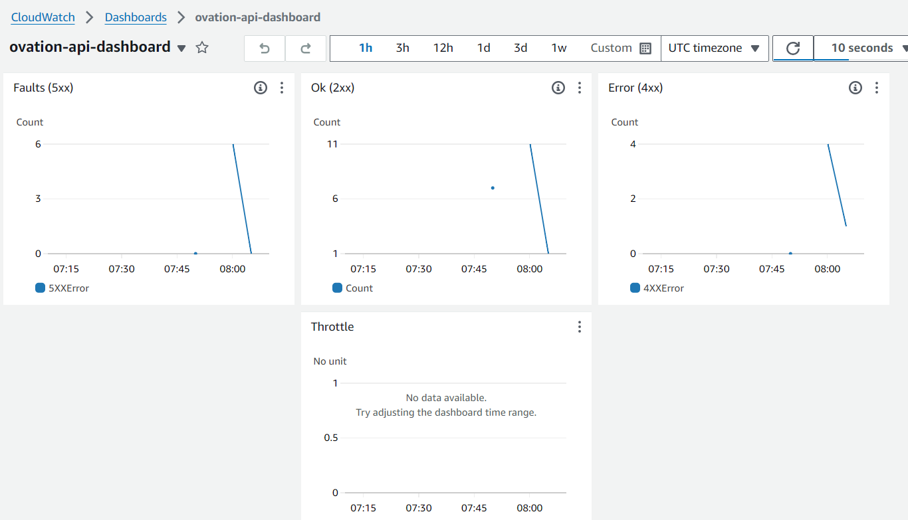

# Prerequisites (considering Linux platform - Ubuntu 22.04 LTS)
## Install aws cli2
https://docs.aws.amazon.com/cli/latest/userguide/getting-started-install.html#getting-started-install-instructions

## Install terraform
https://docs.aws.amazon.com/cli/latest/userguide/getting-started-install.html#getting-started-install-instructions

## setup aws credentials with default profile (This will need AWS access and secret key)
https://docs.aws.amazon.com/cli/latest/reference/configure/#examples

# Provision infra
## Terraform plan
```shell
cd scripts
./provision.sh plan
```

## Terraform apply
```shell
cd scripts
./provision.sh apply
```

## Terraform destroy
```shell
cd scripts
./provision.sh destroy
```

# Access API's

## once we finish the apply command we can see the endpoint to access the apis
```
Apply complete! Resources: 58 added, 0 changed, 0 destroyed.

Outputs:

api_endpoint = "https://3wavt64nc7.execute-api.ap-south-1.amazonaws.com/"
```

## to access the all apis we need to apend the specific routes to above endpoint
```
1. Create API endpoint
api_endpoint = "https://3wavt64nc7.execute-api.ap-south-1.amazonaws.com/v1/create"

2. Read API endpoint
api_endpoint = "https://3wavt64nc7.execute-api.ap-south-1.amazonaws.com/v1/read"

3. Update API endpoint
api_endpoint = "https://3wavt64nc7.execute-api.ap-south-1.amazonaws.com/v1/update"

4. Delete API endpoint
api_endpoint = "https://3wavt64nc7.execute-api.ap-south-1.amazonaws.com/v1/delete"
```

# Logging and Monitoring

## Loggroups create for api gateway and lambda function logging


## Created simple dashboard for monitoring api sum count, 4xx and 5xx errors


## Alarm integration for create and delete APIS


## Realtime metric data


## SNS configured and integrated with cloudwatch alarms


# TODO : 
1. We can store the terraform state to the s3 buckets
